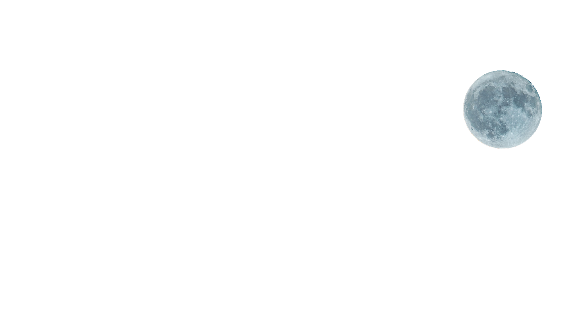

##### 🍑  Front_End 과정 1단계 


## Parallax scrolling 으로 움직이는 느낌주기

```html
    <style>
* { margin: 0;padding: 0; box-sizing: border-box;}
body {background-color: #262829}
.description { border-radius: 6px; 
    background-color: rgb(19, 18,18);
    width: 80vw;  margin: auto;
    color:white;  padding: 60px;  }
.main{  
    display: flex;    align-items: center;
    justify-content: center;
    margin-bottom: 5rem;
    min-height: 100vh;    overflow: hidden;
    position: relative; }
.main::before { content: ""; 
    background-image: linear-gradient(to top, #262829, transparent);
    bottom: 0; height: 7rem;
    position: absolute;
    width: 100%; z-index: 2; }
.main img { 
 /* height: 100%;  */ left: 0; object-fit: cover;
 top:0; width: 100%;  position: absolute;
}
.title {
    font-size: 12vw; line-height: 1.1; 
    position: relative; color:white;
    text-transform: uppercase;}
.road { z-index: 1; }
    </style>
<section class="main">
        
        
        
        
        <h1 class="title" id="title">Parallax</h1>
    </section>
        <div class="description">
            <h1> Parallax Scrolling</h1>
    </div>

<script>
  const bg= document.getElementById('bg')
    const moon= document.getElementById('moon')
    const mountain= document.getElementById('mountain')
    const road= document.getElementById('road')
    const title= document.getElementById('title')
window.addEventListener('scroll', ()=>{
    const {scrollY } = window;
   //  window의 속성을 바로 가져온다 즉 scrollY 값을 가져온다 .
  // console.log(scrollY)
  bg.style.transform=` translateY(${scrollY *0.5}px)`
  moon.style.transform = `translateX(${scrollY * -0.9}px)`
  mountain.style.transform = ` translateY(${scrollY*-0.12}px)`
  road.style.transform=` translateY(${scrollY*0.2}px)`
  title.style.transform = `translateY(${scrollY*0.8}px)`

  console.log("bg ",` translateY (${scrollY *0.5}px)`)
  console.log('moon ' , moon.style.transform)
  console.log('road' , road.style.transform)
})
</script>
```

> 이미지들의 크기를 맞추는 것도 중요하다

참조 ) https://www.youtube.com/watch?v=MXR5vIpE0RQ   

